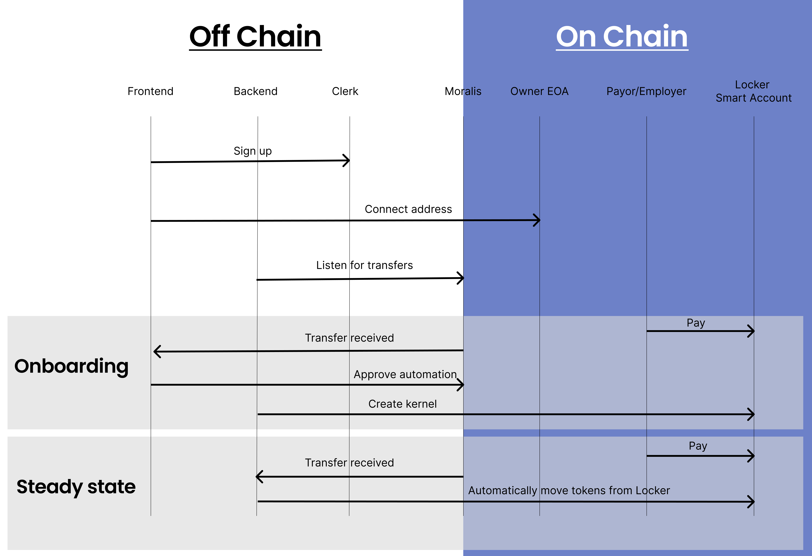

# Locker Dashboard

Save every time you interact or get paid on-chain.

Modular, and non-custodial smart accounts, called Lockers, that automate the allocation of cryptocurrency payments after they've been deposited. Lockers solve the problem of cumbersome, manual distribution of crypto-native salaries and contract payments into channels such as savings, fiat off-ramps, and crypto investments.

[app.locker.money](https://app.locker.money)

## Why Locker

Whether you currently accept payments with your EOA, CEX, or multisig, there are a bunch of cumbersome steps you have to take to get money where you want after the money lands. With Locker, you set up your preferences once and get notified when your tokens automatically do what you want within 30 seconds of deposit.

Here's one example: when a user gets paid in USDC, 5% is swapped for ETH, 15% is saved in an on-chain, yield-bearing savings account, 10% is sent to an on-chain hot wallet, and 70% is off-ramped into their off-chain bank account–all entirely automated.

We hope hackers at ETH Global can use Locker for accepting their winnings and their next web3 contract.

## Getting started

Prerequisites:

- NeonDB
- WalletConnect
- Clerk
- ZeroDev
- Moralis

```sh
# setup environment
cp .env.example .env.development.local

# install dependencies
yarn install

# Generate stream ID
yarn stream:gen

# Run migrations on DB
yarn drizzle:push

# run
yarn dev
```

## Details

### Moralis Stream ID

[Moralis Streams](https://docs.moralis.io/streams-api/evm) are used for getting realtime updates about deposits into Lockers. A single stream is used for processing updates across all chains and addresses. That stream must be created manually and added to your `.env` as `MORALIS_STREAM_ID`. To generate the stream id, `yarn stream:gen`.

### Drizzle Studio

Use `yarn drizzle:studio` then visit [local.drizzle.studio](https://local.drizzle.studio) for

---

### How it's made

- NextJS
- ZeroDev kernels for Lockers
- Moralis for on-chain tx webhooks
- Basic authentication with [Clerk](https://clerk.com/docs) .
- [Tailwind CSS](https://tailwindcss.com/) for utility class styling.
- [Shadcn UI](https://ui.shadcn.com/) for UI components.
- Postgres database on [Neon](https://neon.tech/) .
- [Drizzle ORM](https://orm.drizzle.team/) for managing and interacting with data.
- [Zephyr template](https://github.com/zenzen-sol/zephyr)

Here's a diagram detailing how all these pieces come together. 

### Deployment addresses

Locker uses the ZeroDev SDK to spin up bespoke smart accounts (Lockers) with scoped permissions. As such, we do not have any on-chain factory contracts. Here are contract addresses of some of the Lockers we created while testing. Every time a user creates a Locker, they will generate a similar on-chain contract.

# TODO

| Chain            | Address |
| ---------------- | ------- |
| Gnosis Mainnet   | -       |
| Ethereum Sepolia | -       |
| Arbitrum Sepolia | -       |
| Base Sepolia     | -       |
| Linea Sepolia    | -       |

### Usage

The easiest way to test is by sending ETH or any ERC20 to one of these addresses. You can see how the tokens are automatically distributed and we keep the payment.

Follow these steps to create a Locker and automate your savings.

1. Register for an account
2. Create a Locker
3. Fund your locker
4. Enable automatic savings
5. Get paid and confirm distribution
